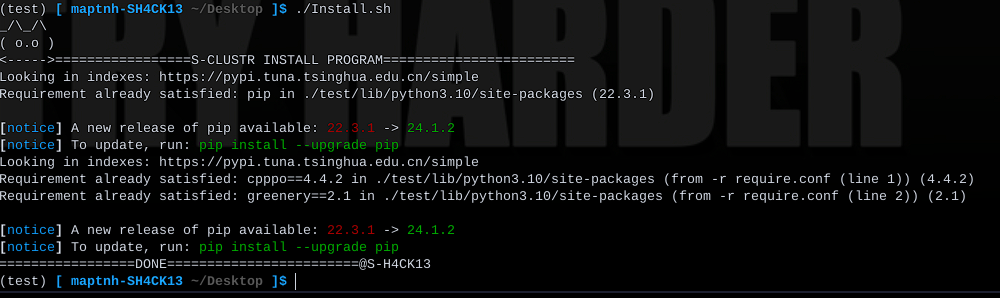
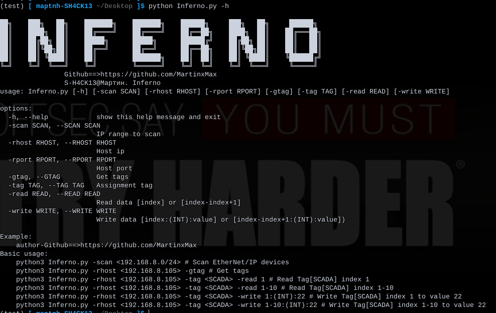
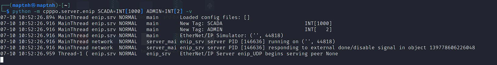
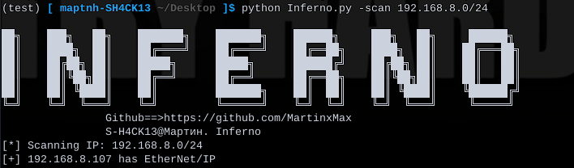
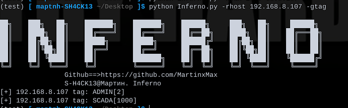
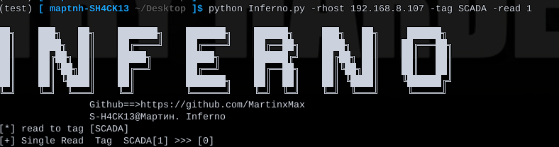
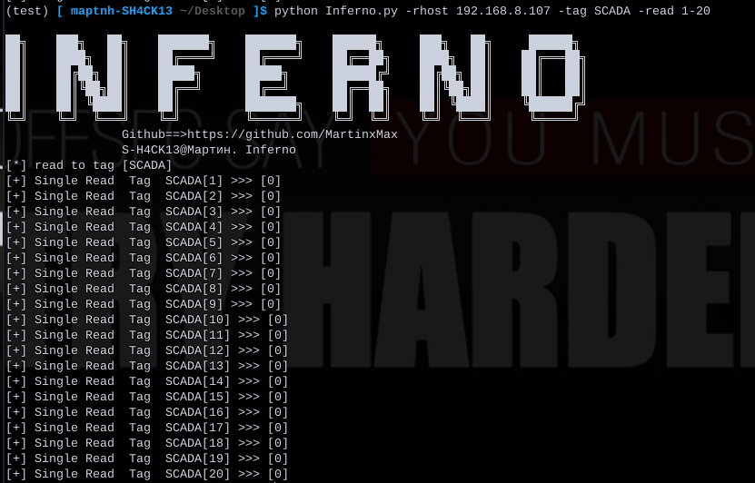
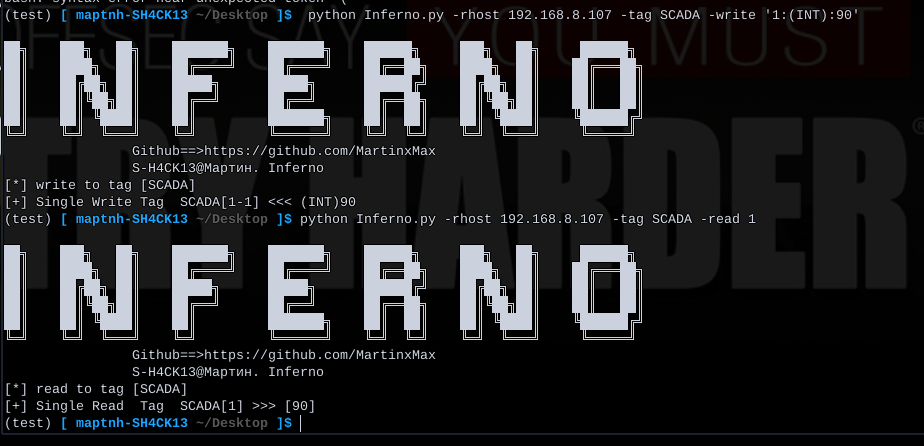
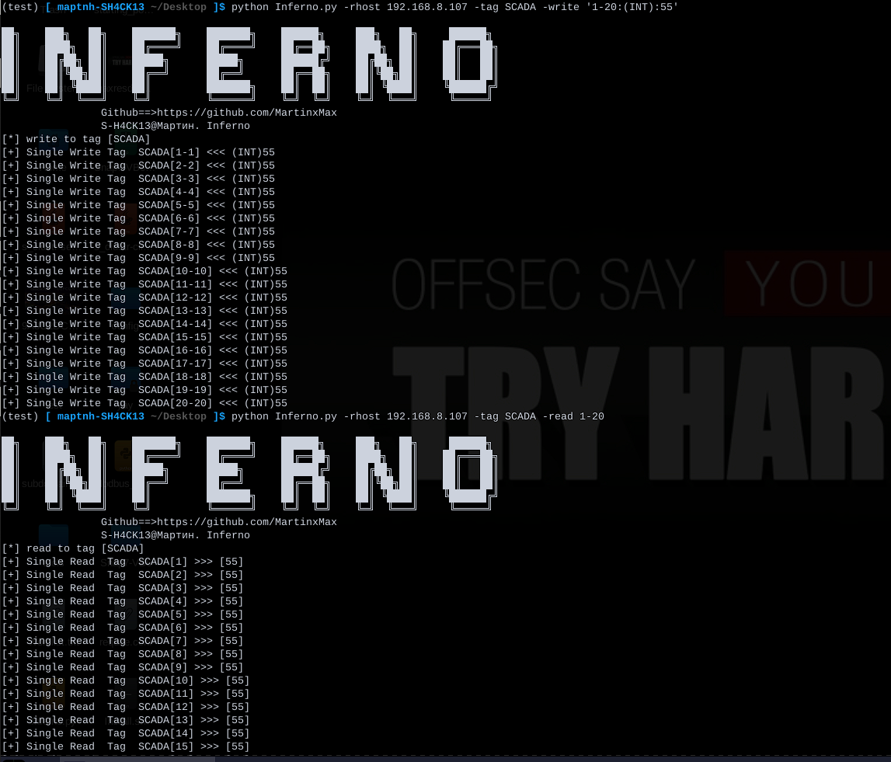

# Inferno

`$ ./Install.sh`

`$ python Inferno.py -h`

## Simulated Server

`$ sudo python3 -m pip install --upgrade cpppo`
`$ python -m cpppo.server.enip SCADA=INT[1000] ADMIN=INT[2] -v`

Create an EtherNet/IP device

## Device Scanning

`$ python Inferno.py -scan 192.168.8.0/24`

## Tag Brute-forcing

`$ python Inferno.py -rhost 192.168.8.107 -gtag`

## Reading

Index 1:

`$ python Inferno.py -rhost 192.168.8.107 -tag SCADA -read 1`

Index 1-20:

`$ python Inferno.py -rhost 192.168.8.107 -tag SCADA -read 1-20`

## Writing

Index 1, type INT, value 90:

`$ python Inferno.py -rhost 192.168.8.107 -tag SCADA -write '1:(INT):90'`

Index 1-20, type INT, value 55:

`$ python Inferno.py -rhost 192.168.8.107 -tag SCADA -write '1-20:(INT):55'`

